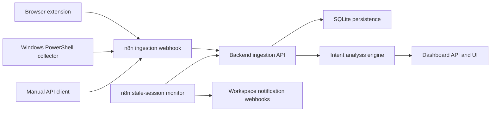

# Architecture

Intent Resurrection Engine is a real intake and recovery system built around three layers:

1. Collectors gather live traces from the user's environment.
2. n8n orchestrates intake and stale-session automation.
3. The backend stores sessions, runs analysis, and serves the dashboard.

## Data Model

- `workspaces`
  logical projects or domains being monitored
- `sources`
  registered ingestion producers, each with a hashed token
- `sessions`
  active or stale work contexts with their latest normalized snapshot
- `ingestion_events`
  append-only raw event history for auditing and replay
- `analyses`
  scored intent predictions, evidence, and recommended actions
- `notifications`
  dispatch records for stale-session alerts

## Privacy Controls

- Text is redacted before analysis using secret and identifier patterns.
- Raw source tokens are never stored in plaintext.
- Notification delivery is opt-in and scoped per workspace.
- The dashboard only displays sanitized snapshot previews.

## Why n8n Stays In The Loop

- Collectors can send to one intake endpoint without embedding backend orchestration logic.
- n8n can trigger analysis immediately after ingestion.
- n8n can run the stale-session sweep on a schedule and fan out notifications.
- Future integrations like Slack, Gmail, or ticket creation fit naturally in the same automation layer.
